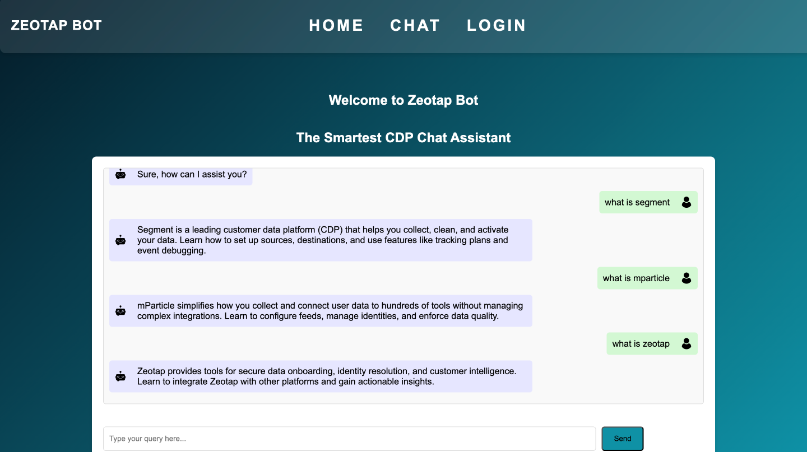

# 🤖 CDP Support Agent Chatbot

**A chatbot that provides "how-to" guidance for Customer Data Platforms (Segment, mParticle, Lytics, and Zeotap) by extracting content from official documentation.**

---

## 🚀 Features

1. **Answer "How-to" Questions**
   - Understands user queries about specific tasks or features in CDPs.
   - Example: "How do I set up a new source in Segment?"

2. **Documentation Scraping**
   - Scrapes content from official documentation of Segment, mParticle, Lytics, and Zeotap.
   - Efficiently fetches relevant sections and paragraphs for user queries.

3. **Semantic Search**
   - Leverages `SentenceTransformer` (`all-MiniLM-L6-v2`) for intelligent matching of queries to documentation content.

4. **Customizable Responses**
   - Handles irrelevant questions gracefully (e.g., topics not related to CDPs).
   - Provides responses with titles, links, and content summaries.

5. **Bonus Features**
   - **Cross-CDP Comparisons**: Answers questions like "How does Segment differ from Lytics?"
   - Handles advanced queries on configuration, integrations, and best practices.

---

## 💻 Tech Stack

- **Backend**: Flask
- **AI/NLP**: SentenceTransformer (`all-MiniLM-L6-v2`)
- **Web Scraping**: BeautifulSoup, `requests`
- **Frontend**: HTML templates (for chatbot UI)
- **Storage**: JSON (for scraped data)

---

## 📄 Key Functionalities

### Web Scraping
- Automatically collects content from CDP documentation for quick responses.

### Semantic Search
- Processes queries and retrieves the most relevant content using cosine similarity.

### Flask Routes
- Implements routes for user queries and chatbot UI.

---

## 📸 Screenshots

### Chat Interface  


### Response Example  


---
## 🌐 Live Link

[Watch the Chatbot in Action](https://zeotapcdp.onrender.com)

---

##  🎥 Video Demo

[View Live Demo](https://youtu.be/JiexqwnZrSA)

---


## 🏁 Getting Started

1. Clone the repository:
   ```bash
   git clone https://github.com/yourusername/cdp-chatbot.git
